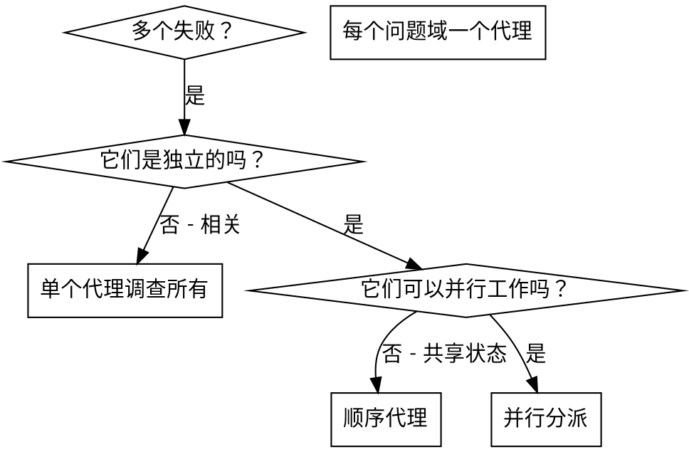

# 分派并行代理

## 概述

当你有多个不相关的失败（不同的测试文件、不同的子系统、不同的bug）时，按顺序调查它们会浪费时间。每个调查都是独立的，可以并行进行。

**核心原则：** 每个独立问题域分派一个代理。让它们并发工作。

## 何时使用



**使用时机：**
- 3个以上的测试文件失败，根本原因不同
- 多个子系统独立损坏
- 每个问题都可以在没有其他上下文的情况下理解
- 调查之间没有共享状态

**不要使用，当：**
- 失败是相关的（修复一个可能修复其他）
- 需要理解完整系统状态
- 代理会相互干扰

## 模式

### 1. 识别独立域

按损坏的内容对失败进行分组：
- 文件A测试：工具审批流程
- 文件B测试：批次完成行为
- 文件C测试：中止功能

每个域都是独立的 - 修复工具审批不会影响中止测试。

### 2. 创建专注的代理任务

每个代理获得：
- **具体范围：** 一个测试文件或子系统
- **明确目标：** 让这些测试通过
- **约束：** 不要更改其他代码
- **预期输出：** 你发现和修复的内容的总结

### 3. 并行分派

```typescript
// 在 Claude Code / AI 环境中
Task("修复 agent-tool-abort.test.ts 失败")
Task("修复 batch-completion-behavior.test.ts 失败")
Task("修复 tool-approval-race-conditions.test.ts 失败")
// 三个同时运行
```

### 4. 审查和集成

当代理返回时：
- 阅读每个总结
- 验证修复不冲突
- 运行完整测试套件
- 集成所有更改

## 代理提示结构

好的代理提示是：
1. **专注的** - 一个明确的问题域
2. **自包含的** - 理解问题所需的所有上下文
3. **输出具体** - 代理应该返回什么？

```markdown
修复 src/agents/agent-tool-abort.test.ts 中的3个失败测试：

1. "should abort tool with partial output capture" - 期望消息中包含 'interrupted at'
2. "should handle mixed completed and aborted tools" - 快速工具被中止而不是完成
3. "should properly track pendingToolCount" - 期望3个结果但得到0

这些是时序/竞态条件问题。你的任务：

1. 阅读测试文件并理解每个测试验证什么
2. 识别根本原因 - 时序问题还是实际bug？
3. 通过以下方式修复：
   - 用基于事件的等待替换任意超时
   - 如果发现中止实现中的bug则修复
   - 如果测试行为已更改则调整测试期望

不要只是增加超时 - 找到真正的问题。

返回：你发现和修复的内容的总结。
```

## 常见错误

**❌ 太宽泛：** "修复所有测试" - 代理迷失
**✅ 具体：** "修复 agent-tool-abort.test.ts" - 专注的范围

**❌ 没有上下文：** "修复竞态条件" - 代理不知道在哪里
**✅ 上下文：** 粘贴错误消息和测试名称

**❌ 没有约束：** 代理可能重构一切
**✅ 约束：** "不要更改生产代码" 或 "仅修复测试"

**❌ 模糊输出：** "修复它" - 你不知道什么改变了
**✅ 具体：** "返回根本原因和更改的总结"

## 何时不使用

**相关失败：** 修复一个可能修复其他 - 先一起调查
**需要完整上下文：** 理解需要看到整个系统
**探索性调试：** 你还不知道什么坏了
**共享状态：** 代理会干扰（编辑相同文件、使用相同资源）

## 会话中的真实示例

**场景：** 重大重构后3个文件中6个测试失败

**失败：**
- agent-tool-abort.test.ts: 3个失败（时序问题）
- batch-completion-behavior.test.ts: 2个失败（工具未执行）
- tool-approval-race-conditions.test.ts: 1个失败（执行计数 = 0）

**决策：** 独立域 - 中止逻辑与批次完成与竞态条件分离

**分派：**
```
代理 1 → 修复 agent-tool-abort.test.ts
代理 2 → 修复 batch-completion-behavior.test.ts
代理 3 → 修复 tool-approval-race-conditions.test.ts
```

**结果：**
- 代理 1：用基于事件的等待替换超时
- 代理 2：修复事件结构bug（threadId 位置错误）
- 代理 3：添加异步工具执行完成的等待

**集成：** 所有修复独立，无冲突，完整套件通过

**节省时间：** 3个问题并行解决 vs 顺序解决

## 关键收益

1. **并行化** - 多个调查同时发生
2. **专注** - 每个代理范围狭窄，要跟踪的上下文更少
3. **独立性** - 代理不相互干扰
4. **速度** - 3个问题在1个问题的时间内解决

## 验证

代理返回后：
1. **审查每个总结** - 理解什么改变了
2. **检查冲突** - 代理编辑了相同的代码吗？
3. **运行完整套件** - 验证所有修复一起工作
4. **抽查** - 代理可能犯系统性错误

## 实际影响

来自调试会话（2025-10-03）：
- 3个文件中6个失败
- 3个代理并行分派
- 所有调查并发完成
- 所有修复成功集成
- 代理更改之间零冲突
