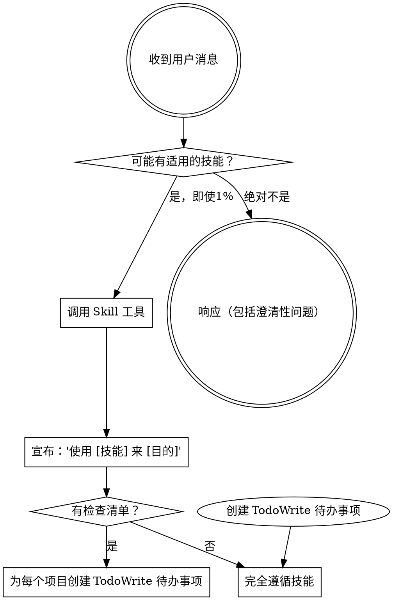

<极其重要>
如果你认为某个技能有哪怕1%的可能性适用于你正在做的事情，你必须绝对调用它。

如果某个技能适用于你的任务，你别无选择。你必须使用它。

这是不可协商的。这不是可选项。你无法通过辩解来逃避这一点。
</极其重要>

## 如何访问技能

**在 Claude Code 中：** 使用 `Skill` 工具。当你调用技能时，其内容会被加载并呈现给你——直接遵循它。永远不要使用 Read 工具来读取技能文件。

**在其他环境中：** 查看你的平台文档了解如何加载技能。

# 使用技能

## 规则

**在任何响应或行动之前调用相关或被请求的技能。** 即使1%的可能性某个技能适用，你也应该调用该技能进行检查。如果调用的技能结果不适合当前情况，你就不需要使用它。

## 危险信号

这些想法意味着停止——你在进行合理化：

| 想法 | 现实 |
|---------|---------|
| "这只是个简单的问题" | 问题就是任务。检查是否有适用的技能。 |
| "我需要先了解更多上下文" | 技能检查在澄清性问题之前。 |
| "让我先探索一下代码库" | 技能告诉你如何探索。先检查。 |
| "我可以快速检查 git/文件" | 文件缺乏对话上下文。检查是否有技能。 |
| "让我先收集信息" | 技能告诉你如何收集信息。 |
| "这不需要正式的技能" | 如果技能存在，使用它。 |
| "我记得这个技能" | 技能会演进。阅读当前版本。 |
| "这不算是任务" | 行动 = 任务。检查是否有技能。 |
| "用技能太过了" | 简单的事情会变得复杂。使用它。 |
| "我先把这件事做了" | 在做任何事情之前先检查。 |
| "这感觉很有效率" | 无纪律的行动浪费时间。技能可以防止这一点。 |
| "我知道那是什么意思" | 知道概念 ≠ 使用技能。调用它。 |

## 技能优先级

当多个技能可能适用时，使用以下顺序：

1. **流程技能优先**（头脑风暴、调试）- 这些决定如何接近任务
2. **实现技能其次**（前端设计、mcp-builder）- 这些指导执行

"我们来构建 X" → 先头脑风暴，然后实现技能。
"修复这个 bug" → 先调试，然后领域特定技能。

## 技能类型

**严格的**（TDD、调试）：完全遵循。不要偏离纪律。

**灵活的**（模式）：根据上下文调整原则。

技能本身会告诉你属于哪一种。

## 用户指令

指令说明要做什么（WHAT），而不是怎么做（HOW）。"添加 X" 或 "修复 Y" 并不意味着跳过工作流。
